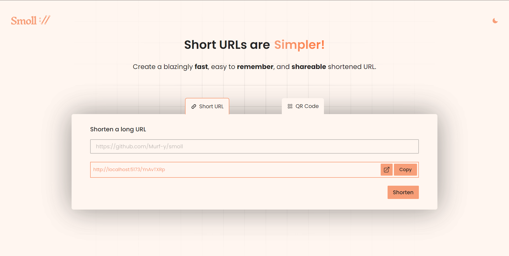
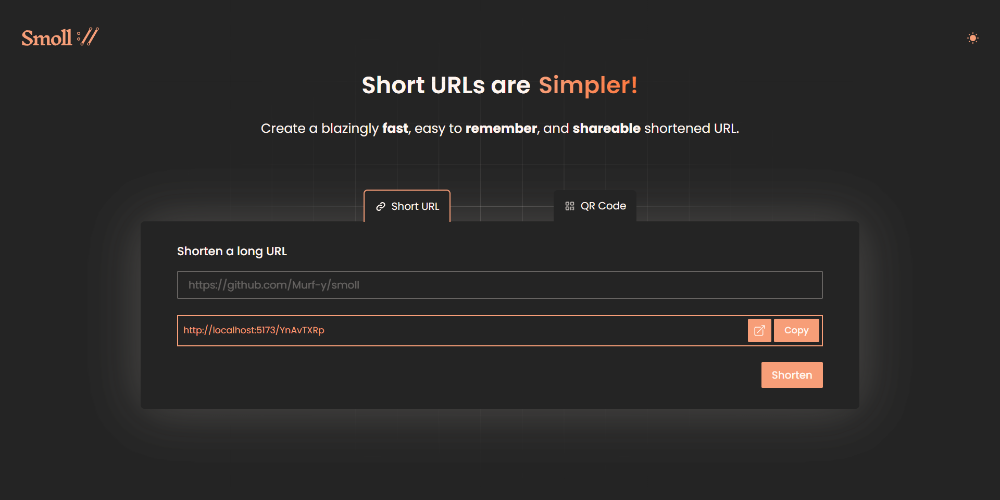
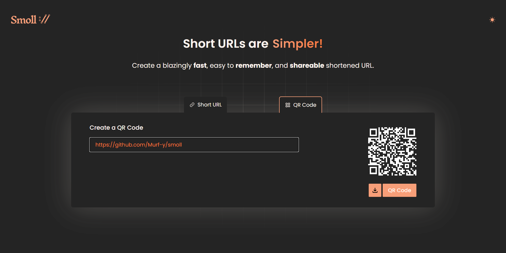
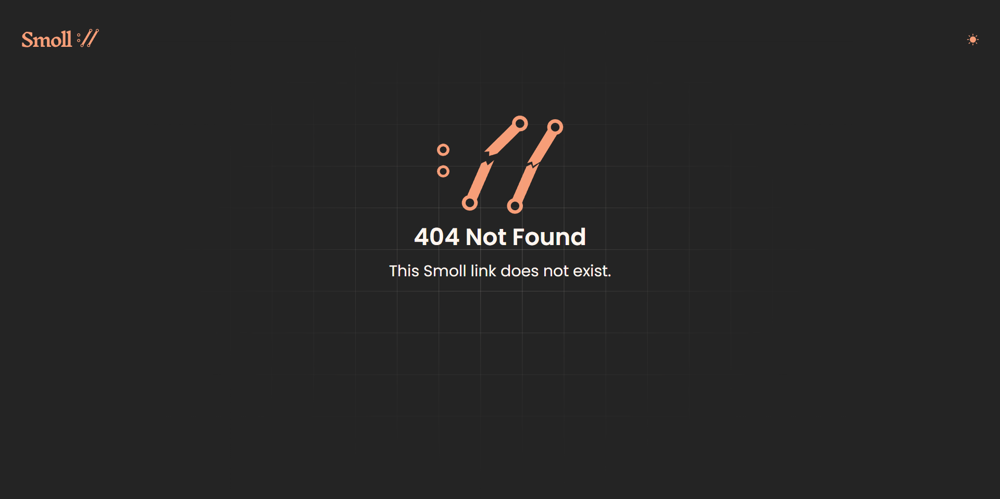

# Smoll 🔗

A simple and beutiful URL shortener written in SolidJS.
Corresponding backend can be found [here](https://github.com/Murf-y/smoll_backend)

## Features

- Shorten URLs
- QR Code generation
- Themes
- Secure

## Preview






## Installation

1. Clone the repo

   ```sh
   git clone
    ```

2. Install NPM packages

    ```sh
    npm install
    ```

3. Create .env file (copy the .env.example) and enter backend url (check backend repo [here](https://github.com/Murf-y/smoll_backend))

4. Start the server

    ```sh
    npm run dev
    ```

5. Open the app in your browser

    ```sh
    http://localhost:5173/
    ```

## License

Licensed under the MIT License. See `LICENSE` for more information.
